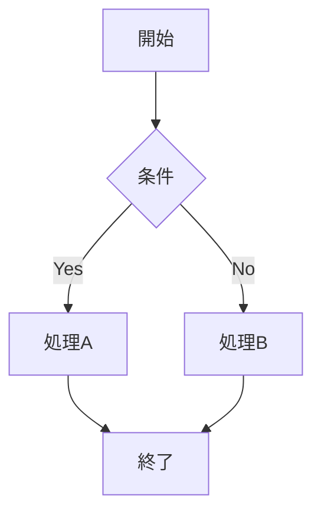

# Markdown Viewer ヘルプ

Windows用のMarkdownビューアアプリケーションです。Mermaid図表対応、全文検索、ブックマーク機能を搭載しています。

---

## 🔍 検索機能

### 基本的な使い方

1. フォルダを開く（`Ctrl+O`）
2. 左パネルの検索ボックスにキーワードを入力
3. 🔍 ボタンをクリック または `Enter` キーで検索実行
4. 検索結果一覧が表示されます
5. 結果をクリックすると該当ファイルの該当行が開きます

### 検索オプション

| オプション | 説明 | アイコン |
|----------|------|---------|
| **大文字小文字区別** | Case-sensitive検索を有効化 | `Aa` |
| **正規表現** | 正規表現パターンでマッチング | `.*` |
| **ファイル名検索** | ファイル名のみを検索対象に | `📄` |

### マルチキーワード検索

スペース区切りで複数キーワードを入力できます。

```
例: python import
→ "python" と "import" の両方が含まれる行を検索（AND検索）
```

将来的にAND/OR切り替えに対応予定です。

### 検索結果の見方

- **ファイル名**: マッチしたファイル名
- **行番号**: マッチした行の番号
- **プレビュー**: マッチした行の内容
- **マッチ数**: その行内のマッチ回数（赤色バッジ）

### ハイライト機能

検索結果から開いたファイルでは：
- 該当行が**黄色でフラッシュ**（2秒間）
- 検索キーワードが**赤色で強調表示**

### エクスポート機能

検索結果画面右上の「📋 Export」ボタンで、結果をMarkdown形式でクリップボードにコピーできます。

---

## ⭐ ブックマーク

### ブックマークの追加・削除

**方法1**: キーボードショートカット
- `Ctrl+B` でブックマークをトグル（追加/削除）

**方法2**: 左パネルのボタン
- 左パネルの「⭐」ボタンでブックマーク一覧を表示

### ブックマーク一覧

- 最終アクセス日時の新しい順に表示
- クリックでファイルを即座に開ける
- `~/.markdown-viewer/bookmarks.json` に保存

---

## ⏱ 最近開いたファイル

### 表示方法

**方法1**: キーボードショートカット
- `Ctrl+H` で最近開いたファイル一覧を表示

**方法2**: 左パネルのボタン
- 左パネルの「⏱」ボタンをクリック

### 仕様

- 直近**10件**のファイルを自動追跡
- 最終アクセス日時の新しい順に表示
- TreeView、検索結果、ブックマークから開いたファイルも記録

---

## ⌨️ キーボードショートカット

### ファイル操作

| ショートカット | 機能 |
|--------------|------|
| `Ctrl+O` | フォルダを開く |
| `Ctrl+T` | 新しいタブを追加 |
| `Ctrl+W` | 現在のタブを閉じる |
| `Ctrl+Tab` | 次のタブに移動 |
| `Ctrl+Shift+Tab` | 前のタブに移動 |
| `F5` | ファイルを再読み込み（スクロール位置保持） |

### 検索・ナビゲーション

| ショートカット | 機能 |
|--------------|------|
| `Ctrl+F` | 検索ボックスにフォーカス |
| `Ctrl+H` | 最近開いたファイル一覧 |
| `Ctrl+B` | 現在のファイルをブックマーク |
| `ESC` | 戻る（検索結果・一覧から前の画面へ） |

### 表示

| ショートカット | 機能 |
|--------------|------|
| `Ctrl+Shift+O` | アウトライン（目次）表示切替 |
| `Ctrl++` / `Ctrl+=` | ズームイン |
| `Ctrl+-` | ズームアウト |
| `Ctrl+0` | ズームリセット（100%） |

---

## 🎨 対応ファイル形式

### Markdown

| 拡張子 | 対応 |
|--------|------|
| `.md` | ✅ |
| `.markdown` | ✅ |

**対応記法**:
- 見出し（H1～H6）
- 太字、斜体、打ち消し線
- リンク、画像
- コードブロック、インラインコード
- テーブル（GFM形式）
- リスト（順序付き/順序なし）
- タスクリスト
- 引用
- 水平線

### Mermaid図表

コードブロックに `mermaid` を指定すると図表として表示されます。



**対応図表タイプ**:
- フローチャート（`graph TD` / `graph LR`）
- シーケンス図（`sequenceDiagram`）
- クラス図（`classDiagram`）
- 状態図（`stateDiagram-v2`）
- ER図（`erDiagram`）
- 円グラフ（`pie`）
- ガントチャート（`gantt`）

### その他のファイル形式

| 形式 | 拡張子 | 表示方法 |
|------|--------|---------|
| **XML** | `.xml`, `.xsl`, `.xslt`, `.xsd`, `.svg` | シンタックスハイライト |
| **Python** | `.py`, `.pyw` | シンタックスハイライト |
| **CSV** | `.csv` | テーブル形式 |
| **CDXML** | `.cdxml` | 化学構造図（SVG変換） |

---

## 🗂️ タブ管理

### タブの追加

- `Ctrl+T` または ツールバーの「➕ New Tab」
- フォルダを開くと自動的に新しいタブが作成されます

### タブの切り替え

- `Ctrl+Tab` で次のタブへ
- `Ctrl+Shift+Tab` で前のタブへ
- タブをクリックして直接選択

### タブの並び替え

タブをドラッグ&ドロップで並び替えられます。

### タブを閉じる

- `Ctrl+W` で現在のタブを閉じる
- タブの「✖」ボタンをクリック

---

## 📊 統計情報パネル

左パネル下部に表示される統計情報：

| 項目 | 説明 |
|------|------|
| **Lines** | 行数 |
| **Words** | 単語数 |
| **Chars** | 文字数 |
| **H1～H6** | 各レベルの見出し数 |
| **Code** | コードブロック数 |
| **Links** | リンク数 |
| **Images** | 画像数 |

---

## 🔄 セッション管理

### 自動保存

アプリケーション終了時に以下が自動保存されます：

- ウィンドウ位置・サイズ
- 開いているタブとフォルダ
- 各タブで選択中のファイル
- ファイルフィルター設定
- 最近開いたファイル（最大10件）
- 検索履歴（最大5件）

### 保存場所

```
~/.markdown-viewer/
├── session.json     # セッション情報
└── bookmarks.json   # ブックマーク
```

### セッション復元

次回起動時に自動的に前回の状態を復元します。

---

## 🎯 Tips & Tricks

### 1. リンクナビゲーション

- **相対パス**: Markdown内の相対パスリンクをクリックすると、そのファイルが開きます
- **アンカーリンク**: `#見出し` で同一ファイル内の見出しにジャンプ
- **外部URL**: `http://` や `https://` のリンクはシステムブラウザで開きます

### 2. 行番号ガター

Markdownファイル表示時、左側に行番号が表示されます：
- **行番号をクリック**: その行のMarkdownソースをクリップボードにコピー

### 3. ファイルフィルター

左パネル上部のドロップダウンで表示ファイルをフィルタリング：
- **Markdown only**: `.md`, `.markdown` のみ
- **All supported**: サポートされている全形式
- **All files**: すべてのファイル（未対応形式も表示）

### 4. 自動リフレッシュ

ファイルが外部エディタで変更されると自動的に再読み込みされます。
- スクロール位置は保持されます

### 5. 検索のコツ

- **正規表現**: `\d{4}-\d{2}-\d{2}` で日付形式を検索
- **ファイル名検索**: プロジェクト内の特定ファイルを素早く発見
- **複数キーワード**: `TODO FIXME` で複数のマーカーを一括検索

---

## ❓ トラブルシューティング

### Q: 日本語が文字化けする

A: ファイルがUTF-8エンコーディングであることを確認してください。他のエンコーディングには対応していません。

### Q: Mermaid図表が表示されない

A: コードブロックに ` ```mermaid ` と正しく指定されているか確認してください。シンタックスエラーがある場合も表示されません。

### Q: 検索結果が表示されない

A: 以下を確認してください：
- フォルダが正しく開かれているか
- 検索対象ファイルがTreeViewに表示されているか
- フィルター設定が適切か

### Q: ブックマークが消えた

A: `~/.markdown-viewer/bookmarks.json` が破損している可能性があります。このファイルを削除すると空の状態から再スタートできます。

---

## 📝 バージョン情報

アプリケーションのバージョンは、ウィンドウタイトルバーに表示されます。

例: `Markdown Viewer v1.1 [Python]`

---

## 🔗 その他

### フィードバック・バグ報告

問題や改善案があれば、GitHubリポジトリのIssuesでお知らせください。

### ライセンス

このソフトウェアはオープンソースソフトウェアです。

---

**最終更新**: 2026-02-06
