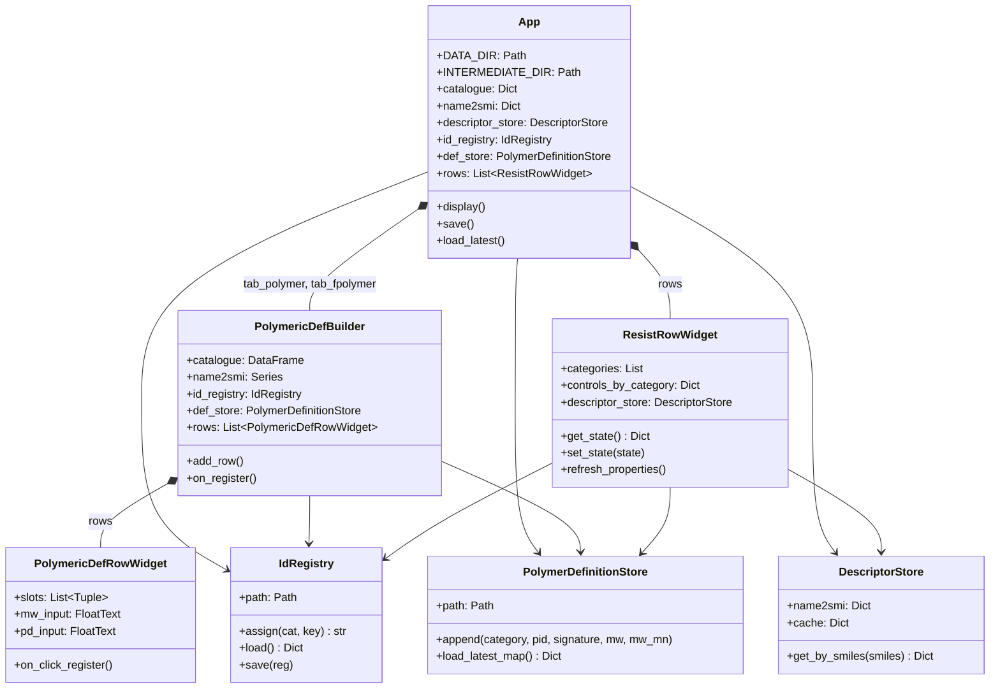
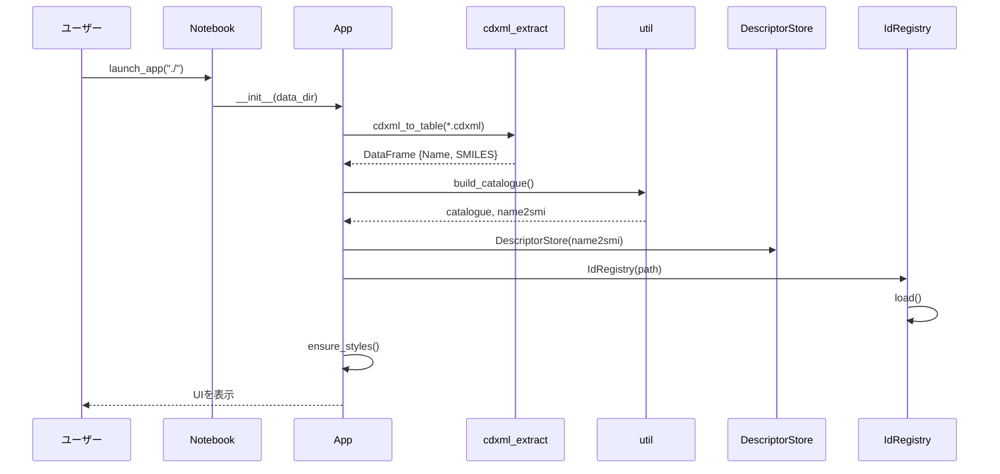
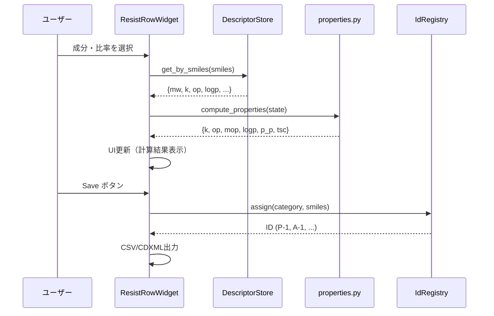
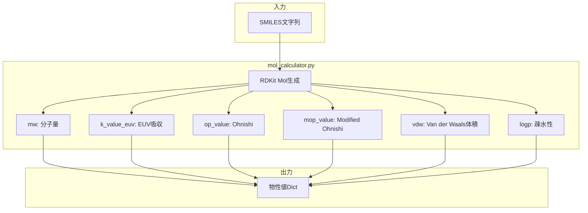

## UIコンポーネント構成



---

## ワークフローシーケンス

### アプリケーション起動



### レジスト配合設計



---

## 物性計算フロー



---

## ワークフロー詳細

### 1. 起動

```python
from app_core import launch_app
app = launch_app("./")
```

1. CDXMLファイル読み込み（cdxml_to_table）
2. カタログ構築（build_catalogue）
3. 物性値キャッシュ初期化（DescriptorStore）
4. ID レジストリ読み込み（IdRegistry.load）
5. UI表示

### 2. ポリマー定義

1. PolymericDefBuilderウィジェットでモノマー比率を入力
2. Signatureを生成（例: "M-1=70;M-2=30"）
3. IdRegistryでIDを発行/取得
4. PolymerDefinitionStoreに保存

### 3. レジスト配合設計

1. ResistRowWidgetで成分と比率を選択
2. compute_properties()でリアルタイム計算
3. 結果をテーブル表示

### 4. 保存

1. App.save()を呼び出し
2. Result_YYMMDD/ディレクトリ作成
3. CSV出力（UTF-8 BOM）
4. ID付きCDXML出力

---

## トラブルシューティング

### CDXML読み込みエラー

**症状**: cdxml_to_tableがエラーを返す

**原因と対策**:
- グループ内にテキスト（名前）がない → CDXMLに名前を追加
- 化学構造が辞書参照のみ → 実体原子として描画
- XMLパースエラー → CDXMLを再保存

### ID重複

**症状**: 同じSMILESに異なるIDが発行される

**原因**: SMILES正規化の不整合

**対策**:
- `util.canonicalize_smiles()`を必ず使用
- id_registry.jsonを確認・修正

### 物性計算がNaN

**症状**: compute_propertiesがNaNを返す

**原因と対策**:
- SMILESが無効 → RDKitでパース確認
- 3D構造生成失敗（VdW計算） → 2D物性のみ使用
- 成分の重量が0 → 入力値を確認

### UI更新されない

**症状**: 値を変更しても表示が更新されない

**原因**: traitletの同期問題

**対策**:
- `observe()`のコールバック確認
- `with self.hold_trait_notifications():`で一括更新
