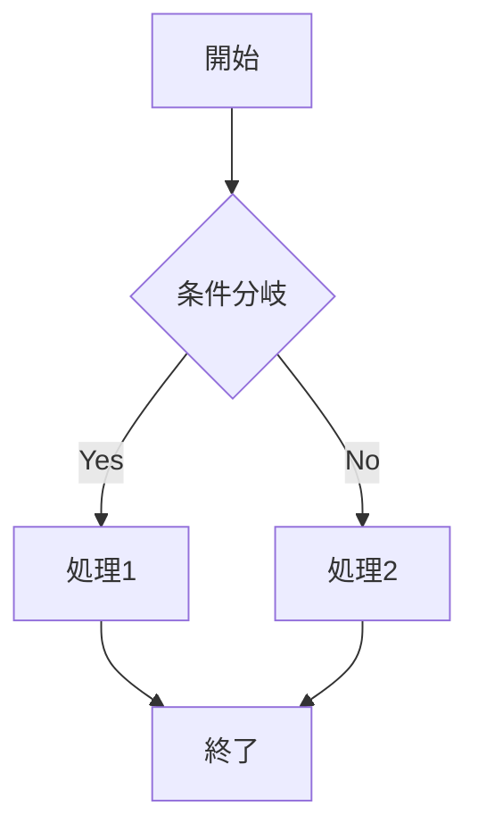
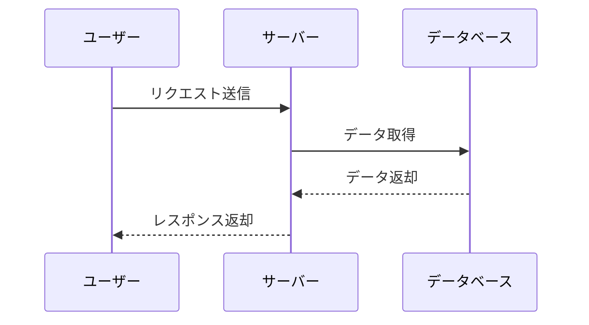
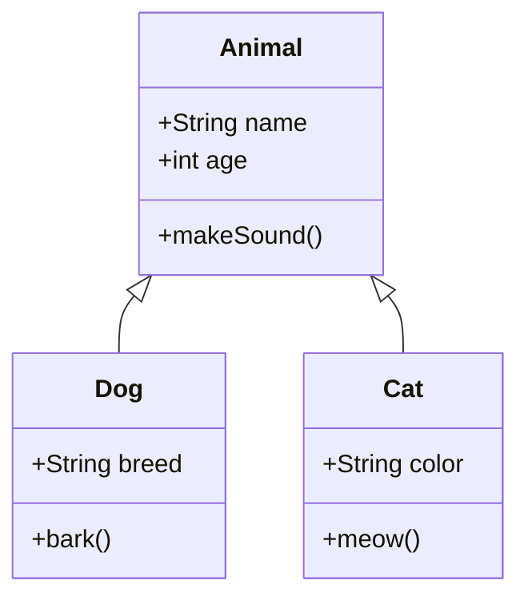
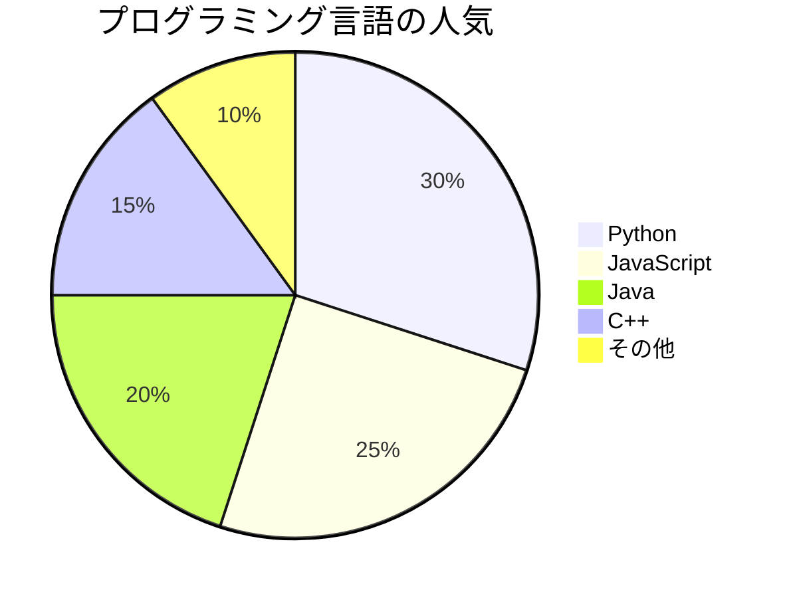

# Markdown Viewer サンプル

これはMarkdown Viewerのサンプルファイルです。

## 基本的なMarkdown記法

### テキスト装飾

- **太字テキスト**
- *イタリック*
- ~~打ち消し線~~
- `インラインコード`

### リンクと画像

[GitHubへのリンク](https://github.com)

### 引用

> これは引用文です。
> 複数行にわたることもできます。

### コードブロック

```python
def hello_world():
    print("Hello, World!")

if __name__ == "__main__":
    hello_world()
```

### テーブル

| 名前 | 年齢 | 職業 |
|------|------|------|
| 田中 | 25 | エンジニア |
| 佐藤 | 30 | デザイナー |
| 鈴木 | 28 | マネージャー |

---

## Mermaid ダイアグラム

### フローチャート



### シーケンス図



### クラス図



### 円グラフ



---

## タスクリスト

- [x] Markdown対応
- [x] Mermaid対応
- [x] CSS装飾
- [x] TreeView表示
- [ ] ダークモード対応（将来の機能）

## 終わりに

このサンプルファイルでMarkdown ViewerのさまざまなMermaid図表が正しく表示されることを確認できます。
