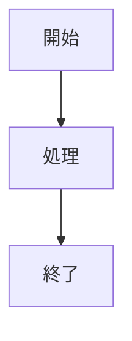

# 機能仕様

## 機能一覧

| ID | 機能名 | 説明 | 優先度 |
|----|--------|------|--------|
| F01 | Markdownレンダリング | .md/.markdownファイルをHTML表示 | 必須 |
| F02 | Mermaid図表 | Mermaidコードブロックの図表化 | 必須 |
| F03 | タブ管理 | 複数ドキュメントの同時表示 | 必須 |
| F04 | ファイルツリー | フォルダ内ファイルの一覧表示 | 必須 |
| F05 | 目次（アウトライン） | 見出しからの自動目次生成 | 必須 |
| F06 | セッション管理 | 状態の保存・復元 | 必須 |
| F07 | 統計情報 | 文字数・行数等の表示 | 任意 |
| F08 | キーボードショートカット | 操作の効率化 | 任意 |
| F09 | リンクナビゲーション | 各種リンクのクリック処理 | 必須 |
| F10 | ナビゲーション履歴 | 戻る機能・履歴スタック | 任意 |
| F11 | コンテキストメニュー | 右クリックメニュー | 任意 |
| F12 | ウェルカムタブ | 初回起動時のヘルプ表示 | 任意 |
| F13 | マルチファイル形式対応 | XML/Python/CSV表示 | 任意 |
| F14 | ファイルタイプバッジ | ツリービューにバッジ表示 | 任意 |
| F15 | ファイルパス表示 | ツールバーに現在のファイルパスを表示 | 任意 |
| F16 | 行番号ガター＆行コピー機能 | 行番号ガター表示＆クリックでソースコピー | 任意 |
| F17 | ズーム機能 | Ctrl++/-/0 でコンテンツ表示倍率を変更 | 任意 |
| F18 | スクロール位置保持 | F5リフレッシュ時にスクロール位置を復元 | 任意 |
| F19 | 全文検索 | フォルダ内全ファイルの横断検索 | 必須 |
| F20 | ブックマーク | 頻繁に使うファイルの登録・管理 | 任意 |
| F21 | 最近開いたファイル | 直近10件のファイル履歴追跡 | 任意 |
| F22 | ツールバー履歴リンク | ツールバーに直近5件のファイルリンクを表示 | 任意 |

---

## F01: Markdownレンダリング

### 概要

Markdownファイルを読み込み、HTMLに変換して表示する。

### 対応形式

| 拡張子 | MIME Type |
|--------|-----------|
| .md | text/markdown |
| .markdown | text/markdown |

### 対応Markdown記法

| 記法 | 例 | 対応 |
|------|-----|------|
| 見出し | `# H1` ~ `###### H6` | ✓ |
| 太字 | `**bold**` | ✓ |
| 斜体 | `*italic*` | ✓ |
| 打ち消し線 | `~~strike~~` | ✓ |
| リンク | `[text](url)` | ✓ |
| 画像 | `` | ✓ |
| コードブロック | ` ```lang ``` ` | ✓ |
| インラインコード | `` `code` `` | ✓ |
| テーブル | GFM形式 | ✓ |
| リスト | `- item` / `1. item` | ✓ |
| タスクリスト | `- [ ] task` | ✓ |
| 引用 | `> quote` | ✓ |
| 水平線 | `---` | ✓ |

### 処理フロー

```
1. ファイル選択（ファイルツリークリック）
2. UTF-8でファイル読み込み
3. marked.jsでHTML変換
4. style.css適用
5. QWebEngineViewに表示
```

### エラー処理

| エラー | 対応 |
|--------|------|
| ファイル読み込み失敗 | エラーメッセージ表示 |
| 文字コードエラー | UTF-8として処理（変換エラーは無視） |
| 非UTF-8ファイル | 「This file appears to be binary or uses an unsupported encoding」警告表示 |

---

## F02: Mermaid図表

### 概要

Markdownのコードブロック内にMermaid記法で記述された図表をレンダリング。

### 対応図表タイプ

| タイプ | 開始キーワード | 例 |
|--------|---------------|-----|
| フローチャート | `graph TD` / `graph LR` | プロセスフロー |
| シーケンス図 | `sequenceDiagram` | API呼び出し |
| クラス図 | `classDiagram` | オブジェクト設計 |
| 状態図 | `stateDiagram-v2` | 状態遷移 |
| ER図 | `erDiagram` | データベース設計 |
| 円グラフ | `pie` | 割合表示 |
| ガントチャート | `gantt` | スケジュール |

### 記述形式

````markdown

````

### 処理フロー

```
1. marked.jsのカスタムレンダラーで言語判定
2. lang === 'mermaid' の場合、専用divでラップ
3. mermaid.initialize() で設定適用
4. mermaid.init() で図表生成
```

### スタイル設定

```javascript
mermaid.initialize({
    startOnLoad: false,
    theme: 'base',
    themeVariables: {
        primaryColor: '#e3f2fd',
        primaryBorderColor: '#1976d2'
    }
});
```

---

## F03: タブ管理

### 概要

複数のフォルダ/ドキュメントを同時に開き、タブで切り替え。

### 機能詳細

| 操作 | 方法 | ショートカット |
|------|------|---------------|
| タブを閉じる | タブの×ボタン / ショートカット | Ctrl+W |
| 次のタブ | ショートカット | Ctrl+Tab |
| 前のタブ | ショートカット | Ctrl+Shift+Tab |
| タブ移動 | ドラッグ＆ドロップ | - |

### 制約

- 最後の1タブは閉じられない（最低1タブ維持）
- タブ数の上限なし

---

## F04: ファイルツリー

### 概要

選択したフォルダ内のファイルを一覧表示。フィルター機能で表示対象を切り替え可能。

### フィルターオプション

| オプション | 表示対象 | 説明 |
|-----------|---------|------|
| Markdown only | .md, .markdown | デフォルト。Markdownファイルのみ表示 |
| All supported | .md, .markdown, .xml, .xsl, .xslt, .xsd, .svg, .py, .pyw, .csv, .cdxml | サポート対象ファイルを表示 |
| All files | すべて | 全ファイルを表示 |

### 表示形式

- ファイル名のみ表示（パスは非表示）
- アルファベット順ソート
- 単一階層（サブフォルダは非対応）

### 操作

| 操作 | 動作 |
|------|------|
| シングルクリック | ファイルを開く |
| フォルダ右クリック | コンテキストメニュー（「Open in New Tab」でフォルダを新タブで開く） |
| 📁 .. ボタン | 親ディレクトリに移動（ツリービュー直上に配置） |
| フォルダ変更 | ツールバーの「Open Folder」 |
| フィルター変更 | ドロップダウンで切り替え |

### 親ディレクトリ移動

- ツリービューの直上に「📁 ..」ボタンを配置（ツリーアイテム風のスタイル）
- クリックで `os.path.dirname(current_folder)` に移動
- ドライブルートでは無効（移動しない）
- 移動時にタブ名・ウィンドウタイトルを更新

### 自動フィルター切り替え

コマンドライン引数で非Markdownファイルを開いた場合、自動的に「All files」フィルターに切り替わる。

---

## F05: 目次（アウトライン）

### 概要

Markdownの見出しから自動的に目次を生成し、右サイドバーに表示。

### 対応見出しレベル

| レベル | 記法 | インデント |
|--------|------|-----------|
| H1 | `#` | なし |
| H2 | `##` | 1段 |
| H3 | `###` | 2段 |
| H4 | `####` | 3段 |

### 機能詳細

| 機能 | 説明 |
|------|------|
| クリックナビゲーション | 見出しクリックで該当位置へスムーズスクロール |
| 現在位置ハイライト | スクロール位置に応じて現在の見出しをハイライト |
| 表示/非表示切り替え | Ctrl+Shift+O またはツールバーボタン（`_toggle_overview()`） |

### 表示幅

- 固定幅: 220px
- 非表示時: 0px（トランジションアニメーション付き）

---

## F06: セッション管理

### 概要

アプリケーション終了時の状態を保存し、次回起動時に復元。

### 保存項目

| 項目 | 説明 |
|------|------|
| ウィンドウ位置 | X, Y座標 |
| ウィンドウサイズ | 幅、高さ |
| タブ情報 | 各タブのフォルダパス、選択ファイル、フィルターインデックス、タブ固有履歴 |
| アクティブタブ | 最後にアクティブだったタブのインデックス |

### 保存場所

```
Windows: C:\Users\{username}\.markdown-viewer\session.json
```

### 保存タイミング

- アプリケーション終了時（closeEvent）

### 復元タイミング

- アプリケーション起動時（コマンドライン引数がない場合）

---

## F07: 統計情報

### 概要

現在表示中のファイルの統計情報を左パネル下部に表示。

### 表示項目

| 項目 | ラベル | 計算方法 |
|------|--------|---------|
| 行数 | Lines | 改行数 + 1 |
| 文字数 | Chars | 文字列長 |
| 単語数 | Words | スペース区切りの要素数 |
| 読了時間 | Read | 単語数 ÷ 200（分） |
| ファイルサイズ | Size | バイト数 ÷ 1024（KB） |

---

## F08: キーボードショートカット

### 一覧

| ショートカット | 機能 | 関連メソッド |
|---------------|------|-------------|
| Ctrl+W | 現在のタブを閉じる | `_close_current_tab()` |
| Ctrl+O | フォルダを開く（新しいタブで） | `_open_folder()` |
| Ctrl+Tab | 次のタブへ | `_next_tab()` |
| Ctrl+Shift+Tab | 前のタブへ | `_prev_tab()` |
| Ctrl+Shift+O | アウトライン切り替え | `_toggle_overview()` |
| F5 | 再読み込み（スクロール位置保持） | `_refresh_current_tab()` |
| Ctrl++ / Ctrl+= | ズームイン | `_zoom_in()` |
| Ctrl+- | ズームアウト | `_zoom_out()` |
| Ctrl+0 | ズームリセット | `_zoom_reset()` |

### 実装

```python
QShortcut(QKeySequence("Ctrl+W"), self, self._close_current_tab)
# ...
```

---

## F09: リンクナビゲーション

### 概要

Markdown内のリンクをクリックした際の処理。リンクの種類に応じて適切なアクションを実行。

### リンク種別と動作

| リンク種別 | 例 | 動作 |
|-----------|-----|------|
| アンカーリンク | `#section` | ページ内スムーズスクロール |
| 外部URL | `https://example.com` | システムブラウザで開く |
| ローカルファイル | `./doc/readme.md` | アプリ内で開く |
| 相対パス（拡張子なし） | `./doc/readme` | `.md`を自動補完して開く |

### アンカーリンク処理

```
1. URLが#で始まるか判定
2. 該当IDの要素をDOM検索
3. scrollIntoView()でスムーズスクロール
```

### 外部URL処理

```
1. http:// または https:// で始まるか判定
2. QDesktopServices.openUrl()でシステムブラウザ起動
```

### ローカルファイル処理

```
1. 現在のファイル/フォルダを基準に相対パス解決
2. ファイル存在チェック
3. .md拡張子がない場合、自動補完を試行
4. ファイルを読み込んでレンダリング
```

### 新しいタブで開く

- **Shift+クリック**: リンクを新しいタブで開く
- `MarkdownWebPage`クラスがキーボード修飾子を検出

---

## F10: ナビゲーション履歴

### 概要

ファイル間の移動履歴を保持し、「戻る」操作を可能にする。

### 機能詳細

| 項目 | 説明 |
|------|------|
| 履歴スタック | 各タブが独自の`navigation_history`リストを保持 |
| 履歴追加タイミング | リンククリックでファイル遷移する直前 |
| 戻る操作 | Backボタンクリックまたは`app://back`スキーム |

### UIコンポーネント

- HTMLテンプレート内にBackボタンを配置
- 履歴が空の場合は非表示

### 処理フロー

```
1. リンククリック検出
2. 現在のファイルを履歴スタックにpush
3. 新しいファイルを開く
4. Backボタン押下で履歴からpop
5. 前のファイルを開く
```

---

## F11: コンテキストメニュー

### 概要

右クリックでコンテキストメニューを表示。Webビュー上のリンクとファイルツリーの両方に対応。

### Webビュー上のメニュー項目

| 項目 | 動作 |
|------|------|
| Open | 現在のタブでリンクを開く |
| Open in New Tab | 新しいタブでリンクを開く |

### ファイルツリー上のメニュー項目

| 項目 | 表示条件 | 動作 |
|------|---------|------|
| Open in New Tab | フォルダの場合のみ | そのフォルダを起点にした新タブを開く |
| Copy Path | 常に表示 | ファイル/フォルダパスをクリップボードにコピー |

### 表示条件

- Webビュー: リンク（`<a>`タグ）上で右クリックした場合のみ表示
- ファイルツリー: 有効なアイテム上で右クリックした場合に表示

### 実装

```
1. customContextMenuRequested シグナルを接続
2. JavaScript で elementFromPoint() を実行
3. クリック位置の要素がリンクか判定
4. QMenu を生成・表示
```

---

## F12: ウェルカムタブ

### 概要

初回起動時（セッション復元がない場合）にヘルプ情報を表示。

### 表示内容

キーボードショートカットの一覧をMarkdown形式で表示：

```markdown
# Markdown Viewer

## Keyboard Shortcuts

| Key | Action |
|-----|--------|
| Ctrl+O | Open Folder |
| Ctrl+W | Close Tab |
| Ctrl+Tab | Next Tab |
| Ctrl+Shift+Tab | Previous Tab |
| Ctrl+Shift+O | Toggle Outline |
| Ctrl+Shift+I | Toggle Stats |
| Ctrl++ | Zoom In |
| Ctrl+- | Zoom Out |
| Ctrl+0 | Zoom Reset |
```

### 表示条件

- セッションファイルが存在しない
- またはセッション復元に失敗した場合

---

## F13: マルチファイル形式対応

### 概要

Markdown以外のファイル形式（XML, Python, CSV）をフォーマット表示。

### 対応形式

| 形式 | 拡張子 | 表示方法 |
|------|--------|---------|
| XML | .xml, .xsl, .xslt, .xsd, .svg | シンタックスハイライト |
| Python | .py, .pyw | シンタックスハイライト |
| CSV | .csv | テーブル形式 |
| CDXML | .cdxml | 化学構造SVG描画 |

### シンタックスハイライト

highlight.jsライブラリを使用してコードをハイライト表示。

| 設定 | 値 |
|------|-----|
| ライブラリ | highlight.js 11.x |
| テーマ | GitHub |
| 配置場所 | src/assets/js/highlight.min.js |
| CSS | src/assets/css/highlight-github.css |

### CSV表示

| 項目 | 説明 |
|------|------|
| ヘッダー行 | 1行目をヘッダーとして強調表示 |
| 統計表示 | 行数・列数を表示 |
| セル幅 | 最大300px、超過分は省略（ellipsis） |

### CDXML表示（化学構造）

ChemDraw CDXML形式のファイルを解析し、化学構造式をSVG画像として描画する。

| 項目 | 説明 |
|------|------|
| パーサー | Python標準ライブラリ `xml.etree.ElementTree`（外部依存なし） |
| 出力形式 | インラインSVG |
| 対応要素 | 原子（座標・元素種・ラベル）、結合（単結合・二重結合・三重結合）、構造名テキスト |
| 原子色 | O:赤, N:青, S:黄, P:橙, ハロゲン:緑/暗赤/紫, C:非表示 |
| 構造数表示 | ヘッダーに検出した構造数を表示 |

### フィルターオプション

| オプション | 表示対象 |
|-----------|---------|
| Markdown only | .md, .markdown |
| All supported | .md, .markdown, .xml, .xsl, .xslt, .xsd, .svg, .py, .pyw, .csv, .cdxml |
| All files | すべて |

---

## F14: ファイルタイプバッジ

### 概要

ツリービューのファイル名横にファイルタイプを示すカラーバッジを表示。

### バッジ設定

| ファイルタイプ | バッジテキスト | 背景色 |
|--------------|--------------|--------|
| Markdown | MD | #4CAF50（緑） |
| XML | XML | #FF9800（オレンジ） |
| Python | PY | #3776AB（Python青） |
| CSV | CSV | #9C27B0（紫） |
| CDXML | CDX | #E91E63（ピンク） |

### 実装

| 項目 | 説明 |
|------|------|
| クラス | FileTypeIconModel（QFileSystemModel継承） |
| 表示位置 | ファイルアイコン位置（ファイル名の左側） |
| アイコンサイズ | 16x16px |
| 角丸 | 3px |

### 表示条件

- ファイルタイプがサポート対象の場合のみバッジアイコン表示
- ディレクトリおよび未対応ファイルはデフォルトアイコン

---

## F15: ファイルパス表示

### 概要

ツールバーの右側に、現在表示中のファイルのフルパスを控えめに表示する。

### 表示位置

- ツールバーのアクションボタン群の右側にスペーサーを挟んで右寄せ配置

### スタイル

| 項目 | 値 |
|------|-----|
| フォントサイズ | 11px |
| 文字色 | #90a4ae（薄いグレー） |
| パディング | 0 8px |
| テキスト選択 | マウスで選択可能 |

### 表示内容

| 状態 | 表示内容 |
|------|---------|
| ファイル選択時 | ファイルのフルパス |
| フォルダのみ選択時 | フォルダパス |
| 未選択時 | 空（非表示） |

### 更新タイミング

- ファイル選択時
- タブ切り替え時
- `_update_window_title()` と同時に更新

---

## F16: 行番号ガター＆行コピー機能

### 概要

Markdownコンテンツの左側に行番号ガターを表示し、ガターの行番号をクリックすると、ファイルパス・行番号・該当行のソーステキストをクリップボードにコピーする。

### ガターシステム

#### Python側処理（lineInfo生成）

`_render_markdown()` 内でMarkdownソースを行ごとに解析し、以下の要素タイプを検出して `lineInfo` JSON配列を生成する。

| タイプ | 検出条件 | lineInfoの`type`値 |
|--------|---------|-------------------|
| 見出し | `#`で始まる行 | `h1`〜`h6` |
| 段落 | 通常テキスト（連続行は最初の行のみ） | `p` |
| リスト項目 | `- `, `* `, `+ `, `1. `で始まる行 | `li` |
| テーブル行 | `\|`で始まり`\|`で終わる行（セパレータ行除外） | `tr` |
| コードブロック | ` ``` ` で始まる行 | `code_fence` / `code_line` |
| 引用 | `>`で始まる行 | `quote` |
| 水平線 | 3文字以上の`-`, `*`, `_`のみの行 | `hr` |

**重要な制約**: `marked.js`は連続するテキスト行を1つの`<p>`要素にマージするため、段落ブロックごとに1つの`p`エントリのみ生成する（`in_paragraph`状態で管理）。

#### JavaScript側処理（buildGutter）

`buildGutter()` 関数がレンダリング済みDOM要素（H1-H6, P, HR, UL, OL, BLOCKQUOTE, TABLE, PRE, `.mermaid`）を走査し、lineInfoとタイプマッチングを行い、`getBoundingClientRect()` で各要素のY座標を取得してガター行を配置する。

#### スクロール同期

`window.scroll` イベントで `#gutter-content` の `transform: translateY(-scrollY)` を更新し、コンテンツとガターのスクロールを同期させる。

#### テンプレート変数

| 変数 | 説明 |
|------|------|
| `$LINE_INFO$` | 行番号・タイプ情報のJSON配列（Python側で生成） |
| `$RAW_LINES$` | ソースを行分割したJSON配列 |
| `$FILE_PATH$` | 現在のファイルのフルパス |

### 操作

| 操作 | 動作 |
|------|------|
| クリック | その行ブロックのソースをコピー |
| Shift+クリック | 最初にクリックした行から範囲選択してコピー |
| ガター外クリック | 選択を解除 |

### コピー形式

```
C:\path\to\file.md:42-45
## セクションタイトル

ここに本文のテキストが
複数行にわたって入る...
```

1行目にファイルパスと行番号、2行目以降に元のMarkdownソースを含む。

### スタイル

| 項目 | 値 |
|------|-----|
| ホバー時背景 | #e3f2fd |
| 選択時背景 | #bbdefb |
| カーソル | pointer |

### フィードバック

コピー成功時に画面下部中央にトースト通知を1.5秒間表示。

### クリップボード実装

`navigator.clipboard.writeText()` はQWebEngineViewの `setHtml()` コンテキストでは動作しない（セキュアコンテキストではないため）。代わりに一時的な `textarea` 要素を作成し、`document.execCommand('copy')` をフォールバックとして使用する。

---

## F17: ズーム機能

### 概要

WebEngineViewのズームレベルを変更し、コンテンツの拡大・縮小表示を行う。

### ショートカット

| ショートカット | 機能 | メソッド |
|---------------|------|---------|
| Ctrl++ / Ctrl+= | ズームイン | `_zoom_in()` |
| Ctrl+- | ズームアウト | `_zoom_out()` |
| Ctrl+0 | ズームリセット | `_zoom_reset()` |

### 動作仕様

| 項目 | 値 |
|------|-----|
| デフォルト倍率 | 1.0x |
| 最小倍率 | 0.3x |
| 最大倍率 | 3.0x |
| 増減ステップ | 0.1 |

### 実装

`QWebEngineView.setZoomFactor()` を使用。現在のタブの `web_view` に対して操作する。

---

## F18: スクロール位置保持（F5リフレッシュ）

### 概要

F5キーでファイルを再読み込みした際、再読み込み前のスクロール位置を保持・復元する。

### 処理フロー

```
1. _refresh_current_tab() で window.pageYOffset を JavaScript で取得（コールバック）
2. コールバック _do_reload() でファイルを再読み込み
3. ナビゲーション履歴をクリア
4. loadFinished シグナルに一時接続
5. ページ読み込み完了後、100msの遅延（QTimer.singleShot）でDOM描画完了を待つ
6. window.scrollTo(0, scrollY) でスクロール位置を復元
```

### 関連メソッド

| メソッド | 説明 |
|---------|------|
| `_refresh_current_tab()` | スクロール位置取得 → `_do_reload()` へ |
| `_do_reload(tab, scroll_y)` | ファイル再読み込み＋スクロール位置復元 |

### 注意事項

- `loadFinished` シグナルは一回限りの接続（復元後に `disconnect`）
- `scroll_y` が `None` または `0` の場合はスクロール復元をスキップ
- DOM描画完了を確実に待つため100msの遅延が必要

---

## F19: 全文検索

### 概要

フォルダ内の全ファイルを対象に全文検索を実行し、結果を一覧表示する。検索結果をクリックすると該当ファイルの該当行にジャンプし、キーワードが赤色でハイライト表示される。

### 検索オプション

| オプション | 説明 | デフォルト |
|----------|------|-----------|
| 大文字小文字区別（Aa） | Case-sensitive検索 | OFF |
| 正規表現（.*） | 正規表現パターンマッチング | OFF |
| ファイル名検索（📄） | ファイル名のみを検索対象とする | OFF |
| AND/OR演算子 | 複数キーワード検索時の論理演算 | AND |

### 検索スコープ切り替え

検索入力フィールドの上部にセグメントトグルボタンを配置し、検索対象範囲を切り替える。

#### トグルボタン

| ラベル | 値 | 説明 | デフォルト |
|--------|-----|------|-----------|
| 全ファイル | `all` | フォルダ内の全ファイルを横断検索（既存動作） | ✓（デフォルト） |
| このファイル | `current` | 現在開いているファイルのみを検索 | - |

#### 配置

- 検索入力フィールドの上に配置

#### 状態制御

| 条件 | 動作 |
|------|------|
| ファイル未選択時（`tab.current_file is None`） | 「このファイル」ボタンを無効化（disabled） |
| 「このファイル」選択中にファイルを閉じた場合 | 自動的に「全ファイル」に切り替え |
| 「このファイル」スコープ選択時 | 「📄 ファイル名検索」「.* 正規表現」チェックボックスを無効化（disabled） |

#### プレースホルダーテキスト

| スコープ | プレースホルダー |
|---------|----------------|
| 全ファイル | `Search in files...` |
| このファイル | `Search in current file...` |

#### 検索実行

| スコープ | 使用メソッド | 動作 |
|---------|-------------|------|
| 全ファイル | `SearchEngine.search()` | 検索結果リストビューに遷移（既存動作） |
| このファイル | `QWebEnginePage.findText()` | ファイルを開いたままページ内検索（Find-in-Page） |

#### 「このファイル」スコープ: Find-in-Page 動作

「このファイル」スコープでは、検索結果画面に遷移せず、`QWebEnginePage.findText()` を使用したブラウザ風ページ内検索を行う。

| 項目 | 説明 |
|------|------|
| ハイライト | WebEngine 組み込みのマッチハイライト（全マッチ箇所が黄色背景） |
| ナビゲーション | ◀ ▶ ボタンで前後のマッチへ移動 |
| カウンター | `N/M` 形式でアクティブマッチ番号/総マッチ数を表示 |
| Enter キー | 次のマッチへ移動（同じクエリの場合） |
| 大文字小文字区別 | `FindCaseSensitively` フラグで対応 |
| 正規表現 | 非対応（`findText()` の制約）→ チェックボックスを無効化 |
| クリアタイミング | スコープ切替時、別ファイル読み込み時 |

##### ナビゲーション UI

検索パネルのボタン行に以下を追加（Find-in-Page アクティブ時のみ表示）:

```
[🔍] [◀] [3/15] [▶]  [⏱] [⭐]
```

- `find_prev_btn`: QPushButton("◀") - 前のマッチへ（`FindBackward` フラグ使用）
- `find_count_label`: QLabel - `active/total` 形式のカウンター
- `find_next_btn`: QPushButton("▶") - 次のマッチへ

#### 「全ファイル」スコープ: 検索結果ヘッダー

| スコープ | ヘッダー表示例 |
|---------|--------------|
| 全ファイル | `15 matches in 3 files`（既存動作） |

#### セッション永続化

- スコープはセッション間で永続化**しない**（常に「全ファイル」がデフォルト）

### 検索方式

#### 単一キーワード検索
- 通常の文字列検索（部分一致）
- 大文字小文字を区別しない場合は`.lower()`で統一

#### 正規表現検索
- `re.compile(pattern, flags)` を使用
- 無効な正規表現の場合はエラーを返さず空の結果を返す

#### マルチキーワード検索
- スペース区切りで複数キーワードを指定
- AND: すべてのキーワードが含まれる行
- OR: いずれかのキーワードが含まれる行

#### ファイル名検索
- ファイル名（basename）に対してのみマッチング
- 内容検索はスキップ

### 検索範囲

- **再帰検索**: フォルダ内の全サブディレクトリを含む
- **対象ファイル**: TreeViewに表示されている全ファイル
- **除外**: バイナリファイル、アクセス権限のないファイルは自動スキップ

### 検索結果表示

#### リストビュー形式

| 表示項目 | 説明 |
|---------|------|
| ファイル名 | ベースネーム |
| 行番号 | マッチした行の番号（1-indexed） |
| マッチプレビュー | マッチした行の内容 |
| マッチ回数 | その行内のマッチ数（赤色バッジ） |
| ファイルパス | 絶対パス |

#### ヘッダー統計情報

```
Search Results: "keyword"
15 matches in 3 files
```

### 検索結果クリック時の動作

```
1. app://search-result?file=<path>&line=<num>&keyword=<keyword> をクリック
2. ファイルを読み込み
3. 該当行までスムーズスクロール（scrollToLine()）
4. 行番号ガターを黄色でフラッシュアニメーション（2秒）
5. キーワードを赤色でハイライト（highlightKeyword()）
6. 検索結果画面を履歴に保存（戻るボタン有効化）
```

### キーワードハイライト仕様

| 項目 | 値 |
|------|-----|
| 背景色 | `#ff5252` (赤) |
| 文字色 | `white` |
| パディング | `2px 4px` |
| フォント太さ | `600` (Semi-bold) |
| 実装 | `<mark>` タグでラップ |

### 検索履歴

- **保存件数**: 直近5件
- **保存内容**: クエリ、オプション、タイムスタンプ
- **保存場所**: `~/.markdown-viewer/session.json`
- **データ構造**:
  ```json
  {
    "search_history": [
      {
        "query": "keyword",
        "case_sensitive": false,
        "regex": false,
        "search_filenames": false,
        "operator": "AND",
        "scope": "all",
        "timestamp": 1234567890.0
      }
    ]
  }
  ```
- **`scope`フィールド**: `"all"`（全ファイル）または `"current"`（このファイル）。セッション復元時のデフォルトスコープには影響しない（常に`"all"`で起動）

### エクスポート機能

- **ボタン**: 検索結果画面右上に「📋 Export」ボタン
- **形式**: Markdown形式
- **出力先**: クリップボード
- **通知**: "Copied to clipboard!" トースト表示

#### エクスポート形式例

```markdown
# Search Results: "keyword"

**15 matches in 3 files**

## file1.md

*C:/path/to/file1.md*

### Line 10
```
This is the matching line content
```

### Line 25
```
Another matching line
```
```

### キーボードショートカット

| ショートカット | 動作 |
|--------------|------|
| `Ctrl+F` | 検索ボックスにフォーカス＆全選択 |
| `ESC` | 検索結果から前の画面に戻る |

### 実装クラス・メソッド

#### SearchEngine クラス

| メソッド | 説明 |
|---------|------|
| `search()` | 全ファイルを横断検索 |
| `search_single_file()` | 指定した単一ファイル内を検索（「このファイル」スコープ用） |
| `_collect_files_recursively()` | TreeModelから再帰的にファイルパス収集 |
| `_search_file()` | 単純文字列検索 |
| `_search_file_regex()` | 正規表現検索 |
| `_search_multi_keyword()` | マルチキーワード検索（AND/OR） |
| `_match_filename()` | ファイル名マッチング |

#### MarkdownViewer クラス

| メソッド | 説明 |
|---------|------|
| `_perform_search(tab)` | 検索実行（スコープに応じて分岐） |
| `_find_in_page(tab, query, case_sensitive)` | Find-in-Page実行（`findText()`使用） |
| `_find_in_page_next(tab)` | 次のマッチへ移動 |
| `_find_in_page_prev(tab)` | 前のマッチへ移動 |
| `_find_in_page_callback(tab, result)` | マッチカウンター更新 |
| `_clear_find_in_page(tab)` | Find-in-Pageクリア＆UI非表示 |
| `_render_search_results(tab, results, query)` | リストビューHTML生成 |
| `_generate_list_items_html(items, type, keyword)` | リストアイテムHTML生成 |
| `_generate_export_markdown(results, query)` | エクスポート用Markdown生成 |
| `_handle_search_result_click(tab, url)` | 検索結果クリック処理 |
| `_load_file_with_highlight(tab, file, line, keyword)` | ファイル読み込み＆ハイライト |
| `_export_search_results(tab)` | クリップボードにエクスポート |

### エラー処理

| エラー | 対応 |
|--------|------|
| 無効な正規表現 | 空の結果を返す（エラーメッセージなし） |
| ファイル読み込み失敗 | そのファイルをスキップ |
| Unicode Decode Error | そのファイルをスキップ |
| Permission Error | そのファイルをスキップ |
| ファイル未発見 | 警告ダイアログ表示 |

---

## F20: ブックマーク

### 概要

頻繁にアクセスするファイルをブックマークとして登録し、一覧から素早く開ける。

### データ構造

```python
@dataclass
class BookmarkEntry:
    file_path: str          # 絶対パス
    file_name: str          # ベースネーム
    folder_path: str        # 親ディレクトリパス
    added_timestamp: float  # 追加日時（UNIX時刻）
    last_accessed: float    # 最終アクセス日時
    note: str              # メモ（オプション、未使用）
```

### 保存場所

```
~/.markdown-viewer/bookmarks.json
```

### JSON形式

```json
{
  "version": "1.0",
  "bookmarks": [
    {
      "file_path": "C:/path/to/file.md",
      "file_name": "file.md",
      "folder_path": "C:/path/to",
      "added_timestamp": 1234567890.0,
      "last_accessed": 1234567890.0,
      "note": ""
    }
  ]
}
```

### 操作

#### ブックマーク追加
- **方法1**: キーボードショートカット `Ctrl+B`
- **方法2**: （未実装：ツールバーボタン）
- **通知**: "Bookmark added" トースト表示

#### ブックマーク削除
- **方法1**: キーボードショートカット `Ctrl+B`（トグル）
- **通知**: "Bookmark removed" トースト表示

#### ブックマーク一覧表示
- **方法1**: 左サイドバーの「⭐ Bookmarks」ボタンクリック
- **方法2**: キーボードショートカット（未実装）

### 一覧表示

統一リストビュー（list_view.html）を使用。

| 表示項目 | 説明 |
|---------|------|
| ファイル名 | ベースネーム |
| フォルダパス | 親ディレクトリ |
| アイコン | ⭐ |

### ソート順

最終アクセス日時の降順（新しい順）

### 実装クラス・メソッド

#### BookmarkManager クラス

| メソッド | 説明 |
|---------|------|
| `add_bookmark(file_path, note)` | ブックマーク追加 |
| `remove_bookmark(file_path)` | ブックマーク削除 |
| `is_bookmarked(file_path)` | ブックマーク状態確認 |
| `get_all_bookmarks()` | 全ブックマーク取得 |
| `update_access_time(file_path)` | 最終アクセス時刻更新 |
| `_load_bookmarks()` | JSON読み込み |
| `_save_bookmarks()` | JSON保存 |

#### MarkdownViewer クラス

| メソッド | 説明 |
|---------|------|
| `_show_bookmarks(tab)` | ブックマーク一覧表示 |
| `_toggle_current_bookmark()` | 現在のファイルのブックマークトグル |

### キーボードショートカット

| ショートカット | 動作 |
|--------------|------|
| `Ctrl+B` | 現在のファイルをブックマークトグル |

### エラー処理

| エラー | 対応 |
|--------|------|
| JSON読み込み失敗 | 空のリストを返す |
| JSON保存失敗 | `False` を返す |
| ファイル未発見 | 警告ダイアログ表示 |

---

## F21: 最近開いたファイル

### 概要

直近10件の開いたファイルを自動追跡し、一覧から素早く再アクセスできる。

### データ構造

SessionManager の `session.json` に保存。

```json
{
  "recent_files": [
    {
      "file_path": "C:/path/to/file.md",
      "file_name": "file.md",
      "folder_path": "C:/path/to",
      "last_accessed": 1234567890.0
    }
  ]
}
```

### 追跡タイミング

- ファイルを TreeView から開いたとき
- 検索結果から開いたとき
- ブックマークから開いたとき
- 最近開いたファイル一覧から開いたとき

### 保存件数

- **最大件数**: 10件
- **追加方式**: 最新のファイルをリストの先頭に追加
- **重複処理**: 既存の同じファイルパスを削除してから追加（順序を最新に）

### 一覧表示

#### 表示方法
- **方法1**: 左サイドバーの「⏱ Recent」ボタンクリック
- **方法2**: キーボードショートカット `Ctrl+H`

#### リストビュー形式

統一リストビュー（list_view.html）を使用。

| 表示項目 | 説明 |
|---------|------|
| ファイル名 | ベースネーム |
| フォルダパス | 親ディレクトリ |
| アイコン | 📄 |

#### ソート順

最終アクセス日時の降順（新しい順）

#### 空の状態

```
🏷 No recent files
Files you open will appear here
```

### 実装クラス・メソッド

#### SessionManager クラス

| メソッド | 説明 |
|---------|------|
| `add_recent_file(file_path)` | 最近開いたファイルに追加 |
| `get_recent_files()` | 最近開いたファイル一覧取得 |

#### MarkdownViewer クラス

| メソッド | 説明 |
|---------|------|
| `_show_recent_files(tab)` | 最近開いたファイル一覧表示 |
| `_handle_open_file_click(tab, url)` | ファイルオープン処理 |

### キーボードショートカット

| ショートカット | 動作 |
|--------------|------|
| `Ctrl+H` | 最近開いたファイル一覧を表示 |

### セッション復元

アプリケーション起動時に `session.json` から自動読み込み。

### 注意事項

- ファイルが存在しなくなっても一覧には残る（クリック時にエラー表示）
- セッションファイルの破損時は空のリストで初期化
- TreeView からファイルを選択した場合は履歴に追加される

---

## F22: ツールバー履歴リンク

### 概要

ツールバー下部の履歴バーに、最近開いたファイルへのクリック可能なリンクを最大8件表示する。ワンクリックで素早くファイルに戻れるクイックアクセス機能。

### F21との関係

- **データソース分離**: F22は各`FolderTab`の`tab_recent_files`リストを使用（タブごとに独立した履歴）。F21は`SessionManager.get_recent_files()`でグローバルな履歴を管理
- **用途の違い**: F21はフルページリスト表示（10件、全タブ共通）、F22は履歴バーのコンパクトなリンク表示（8件、タブごと）

### 表示位置

```
[ツールバー]
[履歴リンク1] › [履歴リンク2] › [履歴リンク3] › ...
[タブウィジェット]
```

- ツールバーとタブウィジェットの間に独立した履歴バーとして配置
- 区切り文字 `›` で各リンクを区別

### 表示内容

| 項目 | 説明 |
|------|------|
| リンクテキスト | ファイル名（ベースネーム）のみ |
| ツールチップ | ファイルのフルパス |
| 最大表示件数 | 8件 |
| 順序 | 最新（左）→ 古い（右） |

### スタイル

| 状態 | スタイル |
|------|---------|
| 通常 | 青色テキスト `#1976d2`、背景透明 |
| ホバー | 濃い青 `#0d47a1`、背景 `#e3f2fd`、角丸3px |
| 現在のファイル | 太字、背景 `#e3f2fd`、色 `#0d47a1` |
| 区切り文字 | 薄いグレー `#b0bec5`、10px |

### クリック動作

| 項目 | 説明 |
|------|------|
| 対象タブ | 現在のアクティブタブ内で開く（新規タブは作成しない） |
| フォルダ切替 | ファイルのフォルダが異なる場合、タブのフォルダコンテキストを自動変更 |
| 履歴保存 | 現在のファイルをナビゲーション履歴に追加（戻る機能対応） |
| ファイル不在 | 警告ダイアログ表示、履歴バーを再描画 |

### 更新タイミング

| タイミング | 説明 |
|-----------|------|
| ファイル選択時 | TreeView からファイルクリック後 |
| リンククリック時 | リスト表示（Recent/Bookmark/検索結果）からファイルオープン後 |
| 戻るボタン時 | ナビゲーション履歴で前のファイルに戻った後 |
| タブ切り替え時 | タブ固有の履歴に切り替え＋現在ファイルのハイライト更新 |
| アプリ起動時 | セッションから復元した履歴を表示 |

### レイアウト

- 左寄せ配置（`QHBoxLayout` に `addStretch()` で右側にスペーサー）

### タブごとの履歴管理

- 各 `FolderTab` が `tab_recent_files` リストを保持（最大8件）
- タブ切り替え時に、アクティブタブの `tab_recent_files` から履歴バーを再構築
- セッション保存・復元に `tab_recent_files` を含む

### 実装メソッド

#### FolderTab クラス

| メソッド | 説明 |
|---------|------|
| `add_recent_file(file_path)` | タブ固有の履歴リストにファイルを追加（最大8件、重複除去） |

#### MarkdownViewer クラス

| メソッド | 説明 |
|---------|------|
| `_update_history_bar()` | 現在タブの `tab_recent_files` から履歴バーのウィジェットを再構築 |
| `_on_history_link_clicked(file_path)` | 履歴リンクのクリックハンドラ |

### FIFO動作

- 9件目のファイルを開くと、最も古い（右端の）リンクが消える
- 同じファイルを再度開いた場合、既存のエントリが先頭に移動（重複なし）
