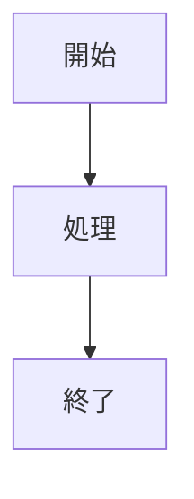

# 機能仕様

## 機能一覧

| ID | 機能名 | 説明 | 優先度 |
|----|--------|------|--------|
| F01 | Markdownレンダリング | .md/.markdownファイルをHTML表示 | 必須 |
| F02 | Mermaid図表 | Mermaidコードブロックの図表化 | 必須 |
| F03 | タブ管理 | 複数ドキュメントの同時表示 | 必須 |
| F04 | ファイルツリー | フォルダ内ファイルの一覧表示 | 必須 |
| F05 | 目次（アウトライン） | 見出しからの自動目次生成 | 必須 |
| F06 | セッション管理 | 状態の保存・復元 | 必須 |
| F07 | 統計情報 | 文字数・行数等の表示 | 任意 |
| F08 | キーボードショートカット | 操作の効率化 | 任意 |
| F09 | リンクナビゲーション | 各種リンクのクリック処理 | 必須 |
| F10 | ナビゲーション履歴 | 戻る機能・履歴スタック | 任意 |
| F11 | コンテキストメニュー | 右クリックメニュー | 任意 |
| F12 | ウェルカムタブ | 初回起動時のヘルプ表示 | 任意 |
| F13 | マルチファイル形式対応 | XML/Python/CSV表示 | 任意 |
| F14 | ファイルタイプバッジ | ツリービューにバッジ表示 | 任意 |

---

## F01: Markdownレンダリング

### 概要

Markdownファイルを読み込み、HTMLに変換して表示する。

### 対応形式

| 拡張子 | MIME Type |
|--------|-----------|
| .md | text/markdown |
| .markdown | text/markdown |

### 対応Markdown記法

| 記法 | 例 | 対応 |
|------|-----|------|
| 見出し | `# H1` ~ `###### H6` | ✓ |
| 太字 | `**bold**` | ✓ |
| 斜体 | `*italic*` | ✓ |
| 打ち消し線 | `~~strike~~` | ✓ |
| リンク | `[text](url)` | ✓ |
| 画像 | `` | ✓ |
| コードブロック | ` ```lang ``` ` | ✓ |
| インラインコード | `` `code` `` | ✓ |
| テーブル | GFM形式 | ✓ |
| リスト | `- item` / `1. item` | ✓ |
| タスクリスト | `- [ ] task` | ✓ |
| 引用 | `> quote` | ✓ |
| 水平線 | `---` | ✓ |

### 処理フロー

```
1. ファイル選択（ファイルツリークリック）
2. UTF-8でファイル読み込み
3. marked.jsでHTML変換
4. style.css適用
5. QWebEngineViewに表示
```

### エラー処理

| エラー | 対応 |
|--------|------|
| ファイル読み込み失敗 | エラーメッセージ表示 |
| 文字コードエラー | UTF-8として処理（変換エラーは無視） |
| 非UTF-8ファイル | 「This file appears to be binary or uses an unsupported encoding」警告表示 |

---

## F02: Mermaid図表

### 概要

Markdownのコードブロック内にMermaid記法で記述された図表をレンダリング。

### 対応図表タイプ

| タイプ | 開始キーワード | 例 |
|--------|---------------|-----|
| フローチャート | `graph TD` / `graph LR` | プロセスフロー |
| シーケンス図 | `sequenceDiagram` | API呼び出し |
| クラス図 | `classDiagram` | オブジェクト設計 |
| 状態図 | `stateDiagram-v2` | 状態遷移 |
| ER図 | `erDiagram` | データベース設計 |
| 円グラフ | `pie` | 割合表示 |
| ガントチャート | `gantt` | スケジュール |

### 記述形式

````markdown

````

### 処理フロー

```
1. marked.jsのカスタムレンダラーで言語判定
2. lang === 'mermaid' の場合、専用divでラップ
3. mermaid.initialize() で設定適用
4. mermaid.init() で図表生成
```

### スタイル設定

```javascript
mermaid.initialize({
    startOnLoad: false,
    theme: 'base',
    themeVariables: {
        primaryColor: '#e3f2fd',
        primaryBorderColor: '#1976d2'
    }
});
```

---

## F03: タブ管理

### 概要

複数のフォルダ/ドキュメントを同時に開き、タブで切り替え。

### 機能詳細

| 操作 | 方法 | ショートカット |
|------|------|---------------|
| 新規タブ | ツールバーボタン / ショートカット | Ctrl+T |
| タブを閉じる | タブの×ボタン / ショートカット | Ctrl+W |
| 次のタブ | ショートカット | Ctrl+Tab |
| 前のタブ | ショートカット | Ctrl+Shift+Tab |
| タブ移動 | ドラッグ＆ドロップ | - |

### 制約

- 最後の1タブは閉じられない（最低1タブ維持）
- タブ数の上限なし

---

## F04: ファイルツリー

### 概要

選択したフォルダ内のファイルを一覧表示。フィルター機能で表示対象を切り替え可能。

### フィルターオプション

| オプション | 表示対象 | 説明 |
|-----------|---------|------|
| Markdown only | .md, .markdown | デフォルト。Markdownファイルのみ表示 |
| All files | すべて | 全ファイルを表示 |

### 表示形式

- ファイル名のみ表示（パスは非表示）
- アルファベット順ソート
- 単一階層（サブフォルダは非対応）

### 操作

| 操作 | 動作 |
|------|------|
| シングルクリック | ファイルを開く |
| フォルダ変更 | ツールバーの「Open Folder」 |
| フィルター変更 | ドロップダウンで切り替え |

### 自動フィルター切り替え

コマンドライン引数で非Markdownファイルを開いた場合、自動的に「All files」フィルターに切り替わる。

---

## F05: 目次（アウトライン）

### 概要

Markdownの見出しから自動的に目次を生成し、右サイドバーに表示。

### 対応見出しレベル

| レベル | 記法 | インデント |
|--------|------|-----------|
| H1 | `#` | なし |
| H2 | `##` | 1段 |
| H3 | `###` | 2段 |
| H4 | `####` | 3段 |

### 機能詳細

| 機能 | 説明 |
|------|------|
| クリックナビゲーション | 見出しクリックで該当位置へスムーズスクロール |
| 現在位置ハイライト | スクロール位置に応じて現在の見出しをハイライト |
| 表示/非表示切り替え | Ctrl+Shift+O またはツールバーボタン |

### 表示幅

- 固定幅: 250px
- 非表示時: 0px（トランジションアニメーション付き）

---

## F06: セッション管理

### 概要

アプリケーション終了時の状態を保存し、次回起動時に復元。

### 保存項目

| 項目 | 説明 |
|------|------|
| ウィンドウ位置 | X, Y座標 |
| ウィンドウサイズ | 幅、高さ |
| タブ情報 | 各タブのフォルダパス、選択ファイル |
| アウトライン状態 | 各タブの表示/非表示 |
| アクティブタブ | 最後にアクティブだったタブのインデックス |

### 保存場所

```
Windows: C:\Users\{username}\.markdown-viewer\session.json
```

### 保存タイミング

- アプリケーション終了時（closeEvent）

### 復元タイミング

- アプリケーション起動時（コマンドライン引数がない場合）

---

## F07: 統計情報

### 概要

現在表示中のファイルの統計情報を左パネル下部に表示。

### 表示項目

| 項目 | ラベル | 計算方法 |
|------|--------|---------|
| 行数 | Lines | 改行数 + 1 |
| 文字数 | Chars | 文字列長 |
| 単語数 | Words | スペース区切りの要素数 |
| 読了時間 | Read | 単語数 ÷ 200（分） |
| ファイルサイズ | Size | バイト数 ÷ 1024（KB） |

---

## F08: キーボードショートカット

### 一覧

| ショートカット | 機能 | 関連メソッド |
|---------------|------|-------------|
| Ctrl+T | 新しいタブを作成 | `_add_new_tab()` |
| Ctrl+W | 現在のタブを閉じる | `_close_current_tab()` |
| Ctrl+O | フォルダを開く | `_open_folder()` |
| Ctrl+Tab | 次のタブへ | `_next_tab()` |
| Ctrl+Shift+Tab | 前のタブへ | `_prev_tab()` |
| Ctrl+Shift+O | アウトライン切り替え | `_toggle_outline()` |
| F5 | 再読み込み | `_reload_current()` |

### 実装

```python
QShortcut(QKeySequence("Ctrl+T"), self, self._add_new_tab)
QShortcut(QKeySequence("Ctrl+W"), self, self._close_current_tab)
# ...
```

---

## F09: リンクナビゲーション

### 概要

Markdown内のリンクをクリックした際の処理。リンクの種類に応じて適切なアクションを実行。

### リンク種別と動作

| リンク種別 | 例 | 動作 |
|-----------|-----|------|
| アンカーリンク | `#section` | ページ内スムーズスクロール |
| 外部URL | `https://example.com` | システムブラウザで開く |
| ローカルファイル | `./doc/readme.md` | アプリ内で開く |
| 相対パス（拡張子なし） | `./doc/readme` | `.md`を自動補完して開く |

### アンカーリンク処理

```
1. URLが#で始まるか判定
2. 該当IDの要素をDOM検索
3. scrollIntoView()でスムーズスクロール
```

### 外部URL処理

```
1. http:// または https:// で始まるか判定
2. QDesktopServices.openUrl()でシステムブラウザ起動
```

### ローカルファイル処理

```
1. 現在のファイル/フォルダを基準に相対パス解決
2. ファイル存在チェック
3. .md拡張子がない場合、自動補完を試行
4. ファイルを読み込んでレンダリング
```

### 新しいタブで開く

- **Shift+クリック**: リンクを新しいタブで開く
- `MarkdownWebPage`クラスがキーボード修飾子を検出

---

## F10: ナビゲーション履歴

### 概要

ファイル間の移動履歴を保持し、「戻る」操作を可能にする。

### 機能詳細

| 項目 | 説明 |
|------|------|
| 履歴スタック | 各タブが独自の`navigation_history`リストを保持 |
| 履歴追加タイミング | リンククリックでファイル遷移する直前 |
| 戻る操作 | Backボタンクリックまたは`app://back`スキーム |

### UIコンポーネント

- HTMLテンプレート内にBackボタンを配置
- 履歴が空の場合は非表示

### 処理フロー

```
1. リンククリック検出
2. 現在のファイルを履歴スタックにpush
3. 新しいファイルを開く
4. Backボタン押下で履歴からpop
5. 前のファイルを開く
```

---

## F11: コンテキストメニュー

### 概要

リンク上での右クリックでコンテキストメニューを表示。

### メニュー項目

| 項目 | 動作 |
|------|------|
| Open | 現在のタブでリンクを開く |
| Open in New Tab | 新しいタブでリンクを開く |

### 表示条件

- リンク（`<a>`タグ）上で右クリックした場合のみ表示
- `href`属性を持つ要素が対象

### 実装

```
1. customContextMenuRequested シグナルを接続
2. JavaScript で elementFromPoint() を実行
3. クリック位置の要素がリンクか判定
4. QMenu を生成・表示
```

---

## F12: ウェルカムタブ

### 概要

初回起動時（セッション復元がない場合）にヘルプ情報を表示。

### 表示内容

キーボードショートカットの一覧をMarkdown形式で表示：

```markdown
# Markdown Viewer

## Keyboard Shortcuts

| Key | Action |
|-----|--------|
| Ctrl+O | Open Folder |
| Ctrl+T | New Tab |
| Ctrl+W | Close Tab |
| Ctrl+Tab | Next Tab |
| Ctrl+Shift+Tab | Previous Tab |
| Ctrl+Shift+O | Toggle Outline |
| F5 | Refresh |
```

### 表示条件

- セッションファイルが存在しない
- またはセッション復元に失敗した場合

---

## F13: マルチファイル形式対応

### 概要

Markdown以外のファイル形式（XML, Python, CSV）をフォーマット表示。

### 対応形式

| 形式 | 拡張子 | 表示方法 |
|------|--------|---------|
| XML | .xml, .xsl, .xslt, .xsd, .svg | シンタックスハイライト |
| Python | .py, .pyw | シンタックスハイライト |
| CSV | .csv | テーブル形式 |

### シンタックスハイライト

highlight.jsライブラリを使用してコードをハイライト表示。

| 設定 | 値 |
|------|-----|
| ライブラリ | highlight.js 11.x |
| テーマ | GitHub |
| 配置場所 | src/assets/js/highlight.min.js |
| CSS | src/assets/css/highlight-github.css |

### CSV表示

| 項目 | 説明 |
|------|------|
| ヘッダー行 | 1行目をヘッダーとして強調表示 |
| 統計表示 | 行数・列数を表示 |
| セル幅 | 最大300px、超過分は省略（ellipsis） |

### フィルターオプション

| オプション | 表示対象 |
|-----------|---------|
| Markdown only | .md, .markdown |
| All supported | .md, .markdown, .xml, .xsl, .xslt, .xsd, .svg, .py, .pyw, .csv |
| All files | すべて |

---

## F14: ファイルタイプバッジ

### 概要

ツリービューのファイル名横にファイルタイプを示すカラーバッジを表示。

### バッジ設定

| ファイルタイプ | バッジテキスト | 背景色 |
|--------------|--------------|--------|
| Markdown | MD | #4CAF50（緑） |
| XML | XML | #FF9800（オレンジ） |
| Python | PY | #3776AB（Python青） |
| CSV | CSV | #9C27B0（紫） |

### 実装

| 項目 | 説明 |
|------|------|
| クラス | FileTypeIconModel（QFileSystemModel継承） |
| 表示位置 | ファイルアイコン位置（ファイル名の左側） |
| アイコンサイズ | 16x16px |
| 角丸 | 3px |

### 表示条件

- ファイルタイプがサポート対象の場合のみバッジアイコン表示
- ディレクトリおよび未対応ファイルはデフォルトアイコン
