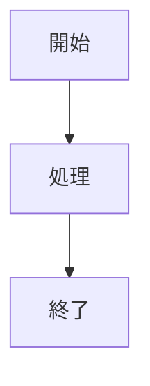

# 機能仕様

## 機能一覧

| ID | 機能名 | 説明 | 優先度 |
|----|--------|------|--------|
| F01 | Markdownレンダリング | .md/.markdownファイルをHTML表示 | 必須 |
| F02 | Mermaid図表 | Mermaidコードブロックの図表化 | 必須 |
| F03 | タブ管理 | 複数ドキュメントの同時表示 | 必須 |
| F04 | ファイルツリー | フォルダ内ファイルの一覧表示 | 必須 |
| F05 | 目次（アウトライン） | 見出しからの自動目次生成 | 必須 |
| F06 | セッション管理 | 状態の保存・復元 | 必須 |
| F07 | 統計情報 | 文字数・行数等の表示 | 任意 |
| F08 | キーボードショートカット | 操作の効率化 | 任意 |

---

## F01: Markdownレンダリング

### 概要

Markdownファイルを読み込み、HTMLに変換して表示する。

### 対応形式

| 拡張子 | MIME Type |
|--------|-----------|
| .md | text/markdown |
| .markdown | text/markdown |

### 対応Markdown記法

| 記法 | 例 | 対応 |
|------|-----|------|
| 見出し | `# H1` ~ `###### H6` | ✓ |
| 太字 | `**bold**` | ✓ |
| 斜体 | `*italic*` | ✓ |
| 打ち消し線 | `~~strike~~` | ✓ |
| リンク | `[text](url)` | ✓ |
| 画像 | `` | ✓ |
| コードブロック | ` ```lang ``` ` | ✓ |
| インラインコード | `` `code` `` | ✓ |
| テーブル | GFM形式 | ✓ |
| リスト | `- item` / `1. item` | ✓ |
| タスクリスト | `- [ ] task` | ✓ |
| 引用 | `> quote` | ✓ |
| 水平線 | `---` | ✓ |

### 処理フロー

```
1. ファイル選択（ファイルツリークリック）
2. UTF-8でファイル読み込み
3. marked.jsでHTML変換
4. style.css適用
5. QWebEngineViewに表示
```

### エラー処理

| エラー | 対応 |
|--------|------|
| ファイル読み込み失敗 | エラーメッセージ表示 |
| 文字コードエラー | UTF-8として処理（変換エラーは無視） |

---

## F02: Mermaid図表

### 概要

Markdownのコードブロック内にMermaid記法で記述された図表をレンダリング。

### 対応図表タイプ

| タイプ | 開始キーワード | 例 |
|--------|---------------|-----|
| フローチャート | `graph TD` / `graph LR` | プロセスフロー |
| シーケンス図 | `sequenceDiagram` | API呼び出し |
| クラス図 | `classDiagram` | オブジェクト設計 |
| 状態図 | `stateDiagram-v2` | 状態遷移 |
| ER図 | `erDiagram` | データベース設計 |
| 円グラフ | `pie` | 割合表示 |
| ガントチャート | `gantt` | スケジュール |

### 記述形式

````markdown

````

### 処理フロー

```
1. marked.jsのカスタムレンダラーで言語判定
2. lang === 'mermaid' の場合、専用divでラップ
3. mermaid.initialize() で設定適用
4. mermaid.init() で図表生成
```

### スタイル設定

```javascript
mermaid.initialize({
    startOnLoad: false,
    theme: 'base',
    themeVariables: {
        primaryColor: '#e3f2fd',
        primaryBorderColor: '#1976d2'
    }
});
```

---

## F03: タブ管理

### 概要

複数のフォルダ/ドキュメントを同時に開き、タブで切り替え。

### 機能詳細

| 操作 | 方法 | ショートカット |
|------|------|---------------|
| 新規タブ | ツールバーボタン / ショートカット | Ctrl+T |
| タブを閉じる | タブの×ボタン / ショートカット | Ctrl+W |
| 次のタブ | ショートカット | Ctrl+Tab |
| 前のタブ | ショートカット | Ctrl+Shift+Tab |
| タブ移動 | ドラッグ＆ドロップ | - |

### 制約

- 最後の1タブは閉じられない（最低1タブ維持）
- タブ数の上限なし

---

## F04: ファイルツリー

### 概要

選択したフォルダ内のMarkdownファイルを一覧表示。

### 表示対象

| 拡張子 | 表示 |
|--------|------|
| .md | ✓ |
| .markdown | ✓ |
| その他 | × |

### 表示形式

- ファイル名のみ表示（パスは非表示）
- アルファベット順ソート
- 単一階層（サブフォルダは非対応）

### 操作

| 操作 | 動作 |
|------|------|
| シングルクリック | ファイルを開く |
| フォルダ変更 | ツールバーの「Open Folder」 |

---

## F05: 目次（アウトライン）

### 概要

Markdownの見出しから自動的に目次を生成し、右サイドバーに表示。

### 対応見出しレベル

| レベル | 記法 | インデント |
|--------|------|-----------|
| H1 | `#` | なし |
| H2 | `##` | 1段 |
| H3 | `###` | 2段 |
| H4 | `####` | 3段 |

### 機能詳細

| 機能 | 説明 |
|------|------|
| クリックナビゲーション | 見出しクリックで該当位置へスムーズスクロール |
| 現在位置ハイライト | スクロール位置に応じて現在の見出しをハイライト |
| 表示/非表示切り替え | Ctrl+Shift+O またはツールバーボタン |

### 表示幅

- 固定幅: 250px
- 非表示時: 0px（トランジションアニメーション付き）

---

## F06: セッション管理

### 概要

アプリケーション終了時の状態を保存し、次回起動時に復元。

### 保存項目

| 項目 | 説明 |
|------|------|
| ウィンドウ位置 | X, Y座標 |
| ウィンドウサイズ | 幅、高さ |
| タブ情報 | 各タブのフォルダパス、選択ファイル |
| アウトライン状態 | 各タブの表示/非表示 |
| アクティブタブ | 最後にアクティブだったタブのインデックス |

### 保存場所

```
Windows: C:\Users\{username}\.markdown-viewer\session.json
```

### 保存タイミング

- アプリケーション終了時（closeEvent）

### 復元タイミング

- アプリケーション起動時（コマンドライン引数がない場合）

---

## F07: 統計情報

### 概要

現在表示中のファイルの統計情報を左パネル下部に表示。

### 表示項目

| 項目 | ラベル | 計算方法 |
|------|--------|---------|
| 行数 | Lines | 改行数 + 1 |
| 文字数 | Chars | 文字列長 |
| 単語数 | Words | スペース区切りの要素数 |
| 読了時間 | Read | 単語数 ÷ 200（分） |
| ファイルサイズ | Size | バイト数 ÷ 1024（KB） |

---

## F08: キーボードショートカット

### 一覧

| ショートカット | 機能 | 関連メソッド |
|---------------|------|-------------|
| Ctrl+T | 新しいタブを作成 | `_add_new_tab()` |
| Ctrl+W | 現在のタブを閉じる | `_close_current_tab()` |
| Ctrl+O | フォルダを開く | `_open_folder()` |
| Ctrl+Tab | 次のタブへ | `_next_tab()` |
| Ctrl+Shift+Tab | 前のタブへ | `_prev_tab()` |
| Ctrl+Shift+O | アウトライン切り替え | `_toggle_outline()` |
| F5 | 再読み込み | `_reload_current()` |

### 実装

```python
QShortcut(QKeySequence("Ctrl+T"), self, self._add_new_tab)
QShortcut(QKeySequence("Ctrl+W"), self, self._close_current_tab)
# ...
```
